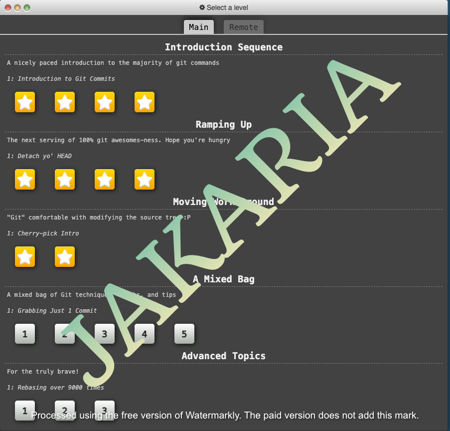
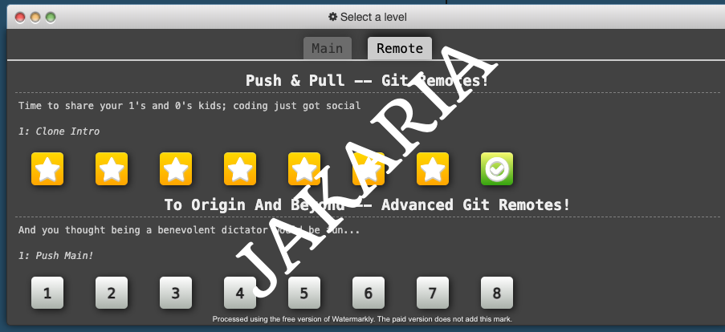
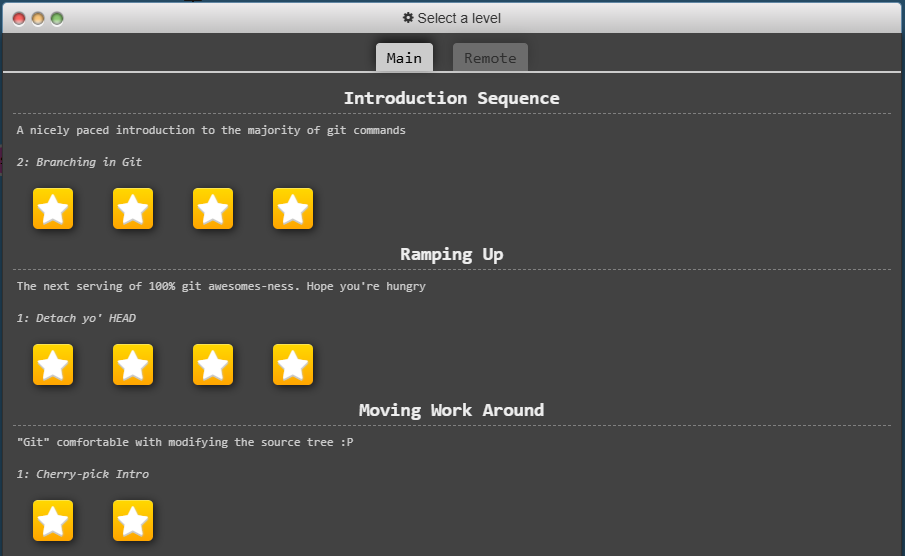
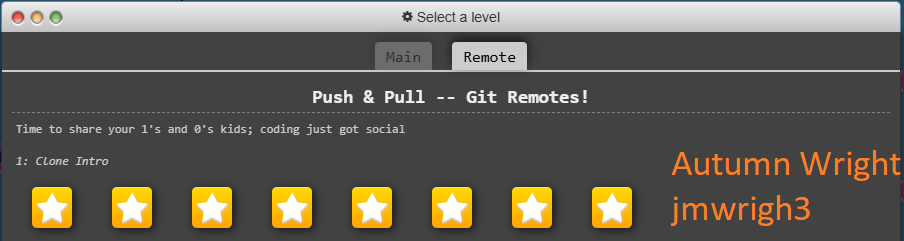
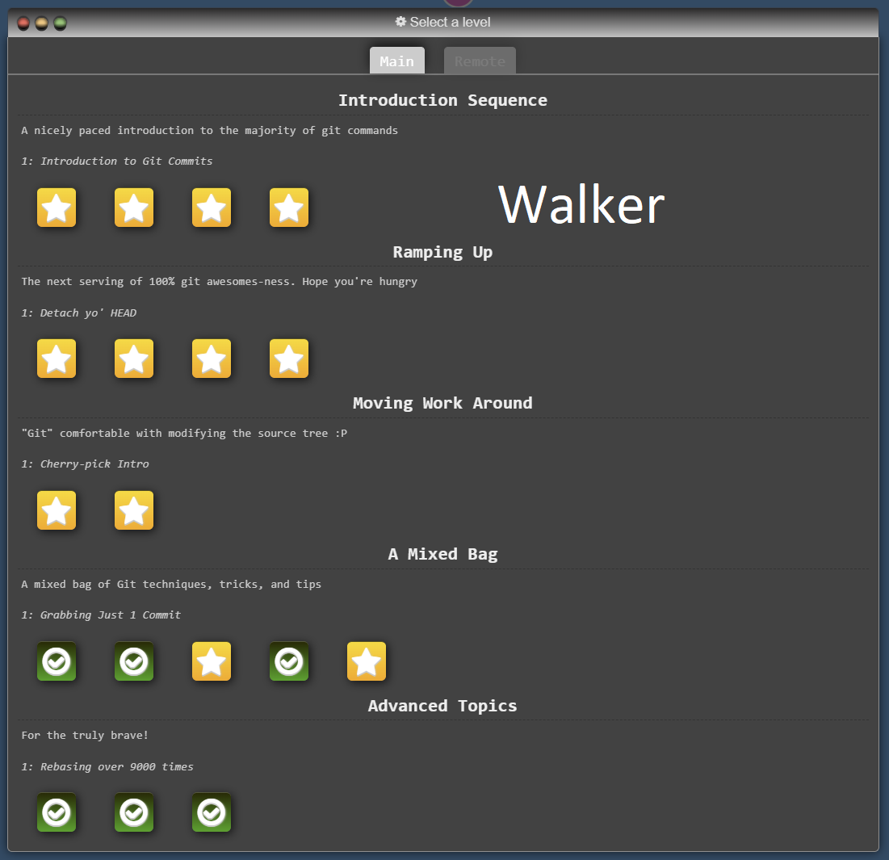
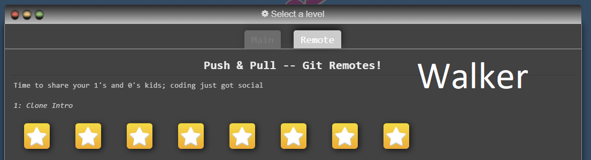

# Homework 2

## 📝 Introduction
A working tutorial on how to interact with GitHub

## Stage all changes for commit
git add .

## Commit the staged changes with a message
git commit -m "Add changes"

## Push to the remote repository
git push origin your_unity_id

## Tasks
- [x] Complete Git Tutorial
- [x] Add Screenshots to README.md
- [x] Modify .html File
- [x] Change a Footer to the Website
- [x] Assign "Help Wanted" Issue
- [x] Work on Assigned Issue
- [x] Merge and Resolve Conflicts
- [ ] Revert Commit
- [ ] Stage Changes

# Tutorial Screenshot
## Md Jakaria 

## Autumn Wright

## Walker Blanchard

