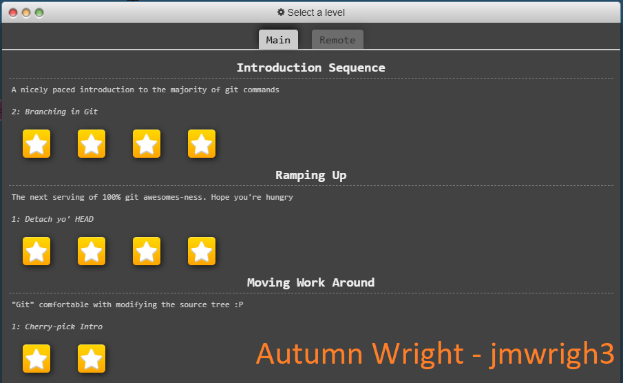

# Homework 2

## 📝 Introduction
A working tutorial on how to interact with GitHub

## Stage all changes for commit
git add .

## Commit the staged changes with a message
git commit -m "Add changes"

## Push to the remote repository
git push origin your_unity_id

## Tasks
- [X] Complete Git Tutorial
- [X] Add Screenshots to README.md
- [ ] Modify .html File
- [ ] Change a Footer to the Website
- [ ] Assign "Help Wanted" Issue
- [ ] Work on Assigned Issue
- [ ] Merge and Resolve Conflicts
- [ ] Revert Commit
- [ ] Stage Changes
